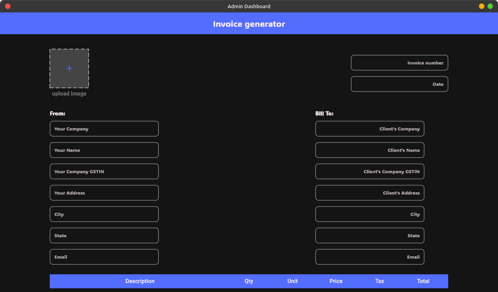
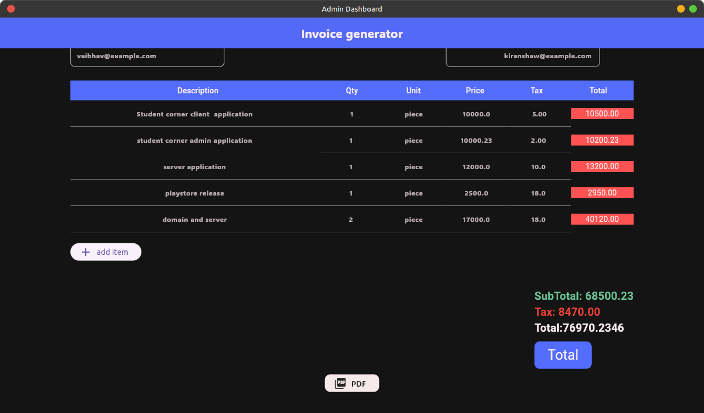
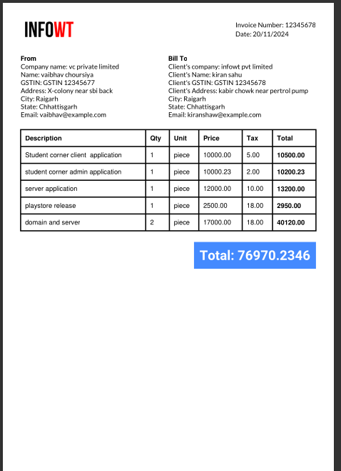

# Invoice Generator

    

**Invoice Generator** is a desktop application that let you generate invoice for transcation.
you can generate invoice and download its pdf version in one-click.

## Download

- **[Stable Release](https://github.com/vaibhavchoursiya/Invoice-Generator/releases/tag/v.1.0.0)**

## Features

- appimage for all linux version
- have different section for each company.
- add , delete and update each Invoice item.
- add logo for company.
- generate pdf in on-click.

## Screenshots

